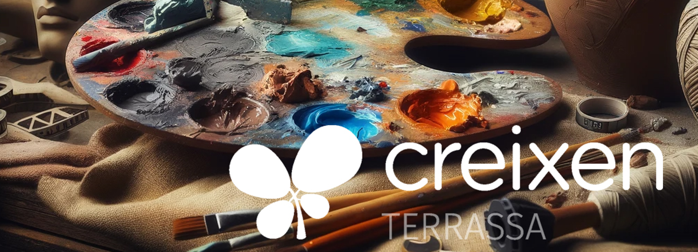

# [ESO2] Títol: El setè art en ODS.

## **Autoria**

Programació creada dins la formació en Competència Digital Docent a l’escola **Creixen Terrassa**.

## **Objectius**

- Conscienciar l’alumnat, fomentar i promoure els objectius de desenvolupament sostenible (ODS).
- Millorar l’autonomia mitjançant l’aprenentatge basat en projectes.
- Fomentar la creativitat.

## **Descripció de la proposta**

Festival de cinema sobre ODS. L’alumnat aprofundirà en les ODS de la mà del cinema, estudiant ODS i tècniques cinematogràfiques per realitzar un curtmetratge. 

## **Alumnat a qui s’adreça especialment**

Etapa ESO

## **Interdisciplinarietat, transversalitat, relacions amb l’entorn**

Educació visual i plàstica, Cultura i valors, Tecnologia i digitalització.

## Programació

Unitat didàctica de 5 dies (30 hores aprox.)

Exploració i Introducció: Avaluació inicial seguida d'un estudi i presentació d’un dels ODS. Finalment s’estudien tècniques cinematogràfiques.

Aplicació: Planificació, filmació i edició d'un curtmetratge relacionat amb un ODS i posterior celebració d'un festival de cinema.

[[ESO2] Programació Didàctica Dia 1.pdf](Programaci%C3%B3%20Did%C3%A0ctica/ESO2_Programaci%C3%B3_Did%C3%A0ctica_Dia_1.pdf)

[[ESO2] Programació Didàctica Dia 2.pdf](Programaci%C3%B3%20Did%C3%A0ctica/ESO2_Programaci%C3%B3_Did%C3%A0ctica_Dia_2.pdf)

[[ESO2] Programació Didàctica Dia 3.pdf](Programaci%C3%B3%20Did%C3%A0ctica/ESO2_Programaci%C3%B3_Did%C3%A0ctica_Dia_3.pdf)

[[ESO2] Programació Didàctica Dia 4.pdf](Programaci%C3%B3%20Did%C3%A0ctica/ESO2_Programaci%C3%B3_Did%C3%A0ctica_Dia_4.pdf)

[[ESO2] Programació Didàctica Dia 5.pdf](Programaci%C3%B3%20Did%C3%A0ctica/ESO2_Programaci%C3%B3_Did%C3%A0ctica_Dia_5.pdf)

