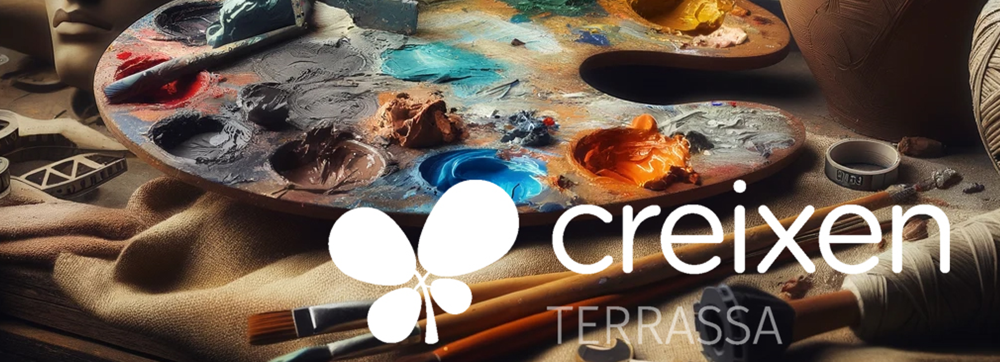

# [PRI3] Títol: Salvem la natura.

## **Autoria**

Programació creada per Ana dins la formació en Competència Digital Docent a l’escola **Creixen Terrassa**.

## **Objectius**

- Sensibilitzar als alumnes i desenvolupar la comprensió de la interconnexió.
- Fomentar el treball en equip i la col·laboració.
- Incentivar la reflexió sobre les petites accions que poden contribuir a millorar el planeta.
- Introduir als alumnes en els ODS d’una manera accessible i rellevant.
- Fomentar la participació activa, el treball en equip i l’empatia.
- Familiaritzar-se amb obres d'art, autors i moviments artístics importants a través d’una presentació. Relacionar l'art amb els Objectius de Desenvolupament Sostenible (ODS).
- Fomentar la discussió i l'anàlisi crítica d'obres d'art i la seva relació amb els ODS
- **Promoure el Coneixement dels ODS**: Fomentar la consciència i la comprensió de l’Objectiu de Desenvolupament Sostenible seleccionat.
- **Desenvolupament de la Creativitat**: Estimular la creativitat dels alumnes mitjançant la ideació i execució del seu propi projecte artístic.

## **Descripció de la proposta**

 La proposta s’ha centrat en l’ODS 7: d’Energia assequible i no contaminant. S’han fet servir materials de reciclatge per fer les creacions dels projectes grupals de diferents estacions d’energies renovables. A més hem relacionat aquest ODS amb l’obra “Clean Energy” de l’artista David Kyte, la qual cada infant ha representat amb diferents materials plàstics.

## **Alumnat a qui s’adreça especialment**

En el curs de 3r de primària, els alumnes de 8 anys continuen desenvolupant les seves habilitats de lectura, escriptura i aritmètica. A més, comencen a explorar temes més complexos a través de les ciències naturals, les ciències socials i les arts visuals, ampliant el seu coneixement del món que els envolta.

## **Interdisciplinarietat, transversalitat, relacions amb l’entorn**

El nostre projecte a tercer de primària integra l'aprenentatge del medi natural i social amb la plàstica i la llengua catalana. A través d'activitats interdisciplinàries, els alumnes exploren les diferents energies renovables i assequibles, creen obres d'art inspirades en l’obra de Energy Clean de David Kyte, i a més fent exposicions orals amb les creacions de les seves propostes d’energies renovables amb maquetes fetes a partir de material per reciclar.

## Programació

# Programació Didàctica: DIA 1

## Durada: 6 hores

## Curs dels alumnes: 3r

## Objectius generals:

- Sensibilitzar als alumnes.
- Desenvolupar la comprensió de la interconnexió.
- Fomentar el treball en equip i la col·laboració.
- Incentivar la reflexió sobre les petites accions que poden contribuir a millorar el planeta.
    
    ---
    

## Horari i Activitats

### 9.15 - 10.00 h: Introducció als ODS (45 min)

**Dinàmica**: “La rotllana per un món millor.”

- Els alumnes parlen sobre que faria cada un d’ells i elles per millorar el món.
- Què són els ODS. Ensenyar pòster i comentar-lo.
- Discussió sobre la importància dels ODS a la vida quotidiana.

**Com encoratjar als alumnes**:

- Donar un gomet que enganxen en un carnet dels ODS.

### 10.00 - 10.30 h: Vídeo educatiu i debat.

Un món per a tothom, defensem la cooperació: Què són els ODS? Ajuntament del Prat. **[https://www.youtube.com/watch?v=RLoSAvGlSy8](https://www.youtube.com/watch?v=RLoSAvGlSy8)**

**Dinàmica**:

- Comprensió del vídeo. Per a què serveixen els ODS? Què hem entès? Quants ODS hi ha?
- Mini-llibreta, on els alumnes escriuran les seves reflexions sobre el vídeo, mentre el visualitzen.

**Com encoratjar als alumnes**:

- Creant un ambient en què els alumnes se sentin motivats, respectats i animats a participar activament.
- Donar un gomet per enganxar al carnet.

### 10.30-11.00 h: Pati

### 11.00-11.30 h: Creació dels cartells ODS.

**Dinàmica**:

- Projectar la imatge dels ODS i per parelles dibuixar l’ODS escollit.
- Muntar un mural amb els ODS realitzats.

**Com encoratjar als alumnes**:

- Comentaris positius durant la realització dels cartells.

### 11.30-12 h: Joc de rol: “Els guardians del planeta”

**Dinàmica**:

- Joc de rol. Els alumnes representen accions quotidianes que contribueixen a la sostenibilitat.

**Com encoratjar als alumnes**:

- Reconeixements verbals i adhesius per omplir el carnet.

### 12-12.45 h: Tria de l’ODS

**Dinàmica**:

- Per grups decidiran quin ODS els agradaria triar per treballar i per què.

Objectiu escollit: ENERGIA ASSEQUIBLE I NO CONTAMINANT.

- Jocs interactius [https://juegosods.com/#juegos](https://juegosods.com/#juegos)

**Com encoratjar als alumnes**:

- Comentaris positius quan cada grup tria un ODS.
- Gomet per enganxar al carnet.

### 15.00 h-15.15 h: Avaluació Inicial

- Fer el test autoavaluatiu Inicial, amb un iPad cadascú, que hem introduït a l’apartat de Plàstica del Clickedu.

### 15.15 h-15.45 h: Classificació d’imatges dels ODS.

**Dinàmica**:

- Classificació d’imatges relacionades amb els ODS en categories corresponents.

**Com encoratjar als alumnes**:

- Aplaudiments i adhesius per a la participació.

### 15.45-16.15 h.: Visualització de vídeos.

**Dinàmica**:

- Veure vídeos sobre energia renovables.
- Comentar i opinar sobre els vídeos.

[https://youtu.be/NWD9Udipw0E?si=wBSmBM9BucWTY09C](https://youtu.be/NWD9Udipw0E?si=wBSmBM9BucWTY09C)

[https://youtu.be/-gEcxkG9zZ8?si=Py7O2mNXZDapNKn-](https://youtu.be/-gEcxkG9zZ8?si=Py7O2mNXZDapNKn-)

**Com encoratjar als alumnes**:

- Animant a participar en les respostes dutes a terme sobre el vídeo.
- Donant un gomet per enganxar en el carnet.

### 16.15-17.00 h: Juguem!

**Dinàmica**:

- Juguem al Bingo dels ODS.

**Com encoratjar als alumnes**:

- Animant al joc.
    
    ---
    

## Materials Necessaris

### Material d'Aula:

- Projector: Per a les presentacions i vídeos.
- Ordinador: 1 per a projectar.
- iPad: 1 per cada alumne.

### Material Didàctic:

- Carnet: 1 de cartolina i plastificat
- Carnet individual: plastificat. Per recompensar la participació.
- Vídeos: Una presentació visual per introduir els Objectius de Desenvolupament Sostenible.
- Imatges que representin els ODS: imatges fotocopiades i plastificades per a classificar.
- Vídeos: sobre l’ODS triat.
- Bingo dels ODS: per a jugar en grup.

### Material d'Escriure:

- Cap.

### Material Addicional:

- Gomets: Per a recompensar la participació.
- Carnet: Per a la dinàmica de participació.

### Altres:

- Mostrar entusiasme durant les activitats per tal que els alumnes també se sentin motivats i compromesos.

### Material d'Avaluació:

L’avaluació és contínua. Es recopilen i analitzen dades sobre el rendiment i progrés dels alumnes al llarg de totes les activitats.

# Programació Didàctica: DIA 2

## Durada: 6 hores

## Curs dels alumnes: 3r

## Objectius generals:

- Introduir als alumnes en els ODS d’una manera accessible i rellevant.
- Desenvolupar la comprensió de la importància dels ODS pel benestar global.
- Fomentar la participació activa, el treball en equip i l’empatia.
- Familiaritzar-se amb obres d'art, autors i moviments artístics importants a través d’una presentació. Relacionar l'art amb els Objectius de Desenvolupament Sostenible (ODS).
- Crear un catàleg de classe amb les obres que més han impactat als alumnes.
- Fomentar la discussió i l'anàlisi crítica d'obres d'art i la seva relació amb els ODS.

## Horari i Activitats

### 9.15 - 10.00 h: “Exploradors del Món sostenible”

- **Dinàmica**:
    - Presentació interactiva dels ODS.
    - [https://youtu.be/MCKH5xk8X-g?si=cL6-YS5cAnXOc4y1](https://youtu.be/MCKH5xk8X-g?si=cL6-YS5cAnXOc4y1)
    - [https://youtu.be/IH_5FaFDgho?si=4MtWPIGogF1aZfmE](https://youtu.be/IH_5FaFDgho?si=4MtWPIGogF1aZfmE)
    - Discussió sobre la importància dels ODS en la vida diària.
    - **Encoratjament**: Adhesius per al carnet dels ODS.

### 10.00-10.30 h: El nostre ODS!

- **Dinàmica:**
    - Per grups realitzaran un dibuix que representi l’ODS triat per la classe en l’activitat anterior.
    - El dibuix el pintaran lliurement.
    - **Encoratjament**: reforç positiu mentre duen a terme les seves creacions.

10.30-11.00 h: Pati

11.00-12.00 h: Continuem el nostre ODS!

- **Dinàmica:**
    - Per grups duran a terme un dibuix que representi l’ODS triat per la classe en l’activitat anterior.
    - El dibuix el pintaran lliurement.
    - **Encoratjament:** reforç positiu mentre duen a terme les seves creacions.

12.00-12.45 h: La nostra creació!

- **Dinàmica:**
    - **En rotació, cada grup mostrarà la seva obra i explicarà què representa i quins materials han fet servir. (opció d'usar el projector per mostrar-la)**
    - **Encoratjament:** Aplaudiments o reconeixement del grup després de cada presentació.

15.15-16.15 h: El nostre mural!

- **Dinàmica:**
    - Entre tot el grup classe munten el mural.
    - Posar títol al mural.
    - Decoració del marc del mural.
    - **Encoratjament:** Animar i valorar tot el procediment.

16.15-16.45 h: Quin ODS?

- **Dinàmica:**
    - Per parelles trien un ODS i fent mímica la resta del grup ha d’endevinar de quin ODS es tracta.
    - Escoltar música de fons relaxant.
    - **Encoratjament:** fer que se sentin segurs davant del grup classe encoratjant-los amb reforç positiu.

Materials Necessaris

### Material d'Aula:

- Ordinador: 1 per a projectar.
- Projector: Per a les presentacions.

### Material Didàctic:

- Vídeos

### Material d'Escriure:

- Cap.

### Material Addicional:

- Fulls blancs. (folis): per realitzar el dibuix de l’ODS triat.
- Colors de fusta, retoladors, ceres toves, diaris, paper de seda, cartolina, paper de xarol, plastidecors…: per dur a terme la creació escollida.

### Altres:

- Altaveus: Per a la música de fons durant la fase de creació artística.
- Mòbil: Per a fotografiar el procés de les creacions.
- Mostrar entusiasme durant les activitats per tal que els alumnes també se sentin motivats i compromesos.

### Material d'Avaluació:

L’avaluació és contínua. Es recopilen i analitzen dades sobre el rendiment i progrés dels alumnes al llarg de totes les activitats.

# Programació Didàctica: DIA 3

## Durada: 6 hores

## Curs dels alumnes: 3r

## Objectius generals:

- **Introduir una Tècnica Artística**: Que els alumnes coneguin i comprenguin els fonaments d'una tècnica artística específica.
- **Promoure el Coneixement dels ODS**: Fomentar la consciència i la comprensió de l’Objectiu de Desenvolupament Sostenible seleccionat.
- **Desenvolupament de la Creativitat**: Estimular la creativitat dels alumnes mitjançant la ideació i execució del seu propi projecte artístic.

## Horari i Activitats

### 9.15 - 9.45 h: Introducció i presentació de la Tècnica Artística.

- **Dinàmica**: Presentació amb exemples visuals de la tècnica artística escollida.
- **Encoratjament**: Assegurar als alumnes que la tècnica que estan utilitzant és versàtil i s’ajusta a les diferents habilitats de cadascú.

### 9.45 -10.30 h: Demostració de les Eines.

- **Dinàmica**: Mostrar en directe el correcte ús de les eines i el material que es farà servir.
- Parlar sobre quina és la tècnica que coneixen preferida i per què.
- **Encoratjament**: Reforç positiu mentre es comuniquen.

10.30-11.00 h: Pati.

11.00-11.45 h: Primera presa de contacte.

- **Dinàmica: Presentar en el projector el quadre que crearan.**

.Parlar sobre l’obra: títol (Clean energy) pintor, colors, tècnica…

- Qui és David Kyte?
- Observar i parlar de l’obra “Clean Energy”
- Buscar altres obres del pintor i observar-les.
- **Encoratjament: Reforç positiu mentre es comuniquen.**

11.45-12.45 h: Iniciem l’obra.

- **Dinàmica: Donar als alumnes l’obra significativa per copiar sobre l’ODS escollit per la classe.**
- Veure l’obra. Parlar sobre fons figura.
- El fons el pintaran amb aquarel·les. La bombeta amb ceres toves, després enganxaran l’arbre fet amb plastilina a sobre i finalment l’envernissaran.
- **Encoratjament: Fomentar la confiança durant el procés d’aprenentatge.**

15-17 h: Continuem la creació.

- **Dinàmica:** Continuen fent la seva obra.
    - Finalment, es mostren les creacions de cada alumne a la resta.
- **Encoratjament: Donar suport positiu en tot moment, felicitant el procés.**

Aplaudiments o reconeixement del grup després de cada presentació.

**_________________________________________________________**

## Materials Necessaris

### Material d'Aula:

- Projector: Per a les presentacions digitals.
- Ordinador: 1 per a projectar.

### Material Didàctic:

- Cap

### Material d'Escriure:

- Cap.

### Material Addicional:

- Fulls de dibuix DIN A3: per fer la creació.
- Obra impresa en color mida Din A3.
- Aquarel·les.
- Ceres toves.
- Plastilina marró i verd.
- Vernís.
- Fulls DIN A3 de dibuix.
- Cola.

### Altres:

- Altaveus: Per a la música de fons durant la fase de creació artística.
- Mòbil: Per a fotografiar el procés de les creacions.
- Mostrar entusiasme durant les activitats per tal que els alumnes també se sentin motivats i compromesos.

### Material d'Avaluació:

L’avaluació és contínua. Es recopilen i analitzen dades sobre el rendiment i progrés dels alumnes al llarg de totes les activitats.

# Programació Didàctica: DIA 4

## Durada: 6 hores

## Curs dels alumnes: 3r

## Objectius generals:

- Fomentar la capacitació dels alumnes per explorar i investigar.
- Desenvolupar habilitats necessàries per a la classificació i organització.
- Fomentar la col·laboració, l’empatia i el treball en equip.
- Desenvolupar la capacitat dels alumnes per expressar-se.

## Horari i Activitats

### 9.15 - 9.30 h: Què recordo?

- **Dinàmica**: Els alumnes comuniquen tot el que recorden que han après dels ODS.
- **Encoratjament**: Oferir gomets per a omplir el carnet.

### 9.30 -10.30 h: Creació en equip.

- **Dinàmica**: Es recordarà i parlarà sobre l’ODS 7. En petits grups hauran de fer un esbós sobre el qual faran i els materials que utilitzaran. Els grups hauran de realitzar representacions de fonts d’energia sostenible. Ex.: panells solars, molins de vent, turbines hidroelèctriques. Per obtenir ajuda podran fer servir les tauletes.
- **Encoratjament**: Incentivar al grup donant ànims i valorant el que van fent.

10.30-11.00 h: Pati.

11.00-12.00 h: Continuem la creació!

- 
- **Dinàmica**: En petits grups hauran de dur a terme representacions de fonts d’energia sostenible. Ex.: panells solars, molins de vent, turbines hidroelèctriques. Per aconseguir ajuda podran usar les tauletes.
- **Encoratjament**: Incentivar al grup donant ànims i valorant el que van fent.

12.00-12.45 h: Les nostres creacions!

- **Dinàmica:** La creació dels meus companys i companyes. Cada grup presenta i explica el projecte a la resta d’alumnes.
- **Encoratjament: Acceptar les opinions dels altres.**

15-17 h: **Scape Room:**

- **Dinàmica**: “Missió sostenible”
- **Descripció**: Els alumnes formen part d’un equip d’agents mediambientals amb la missió de completar desafiaments relacionats amb els ODS per salvar el planeta. Cada desafiament resolt els proporcionarà una “clau” per desbloquejar el següent nivell.
- **Encoratjament**: Animar a la col·laboració, l’intercanvi d'idees i l’ajuda mútua per superar els desafiaments.

Materials Necessaris

### Material d'Aula:

- Altaveus: per escoltar música de fons mentre fan les creacions.
- Ordinador per projectar el Scape Room

### Material Didàctic:

- Cap.

### Material d'Escriure:

- Cap.

### Material Addicional:

- Folis.
- Llapis.
- Cola.
- Pinzells.
- Diferent material: escuradents, plastilina, taps de suro, taps de plàstic, papers diferents...
- Tauletes.

### Altres

- Mòbil: Per a fotografiar el procés de les creacions.
- Mostrar entusiasme durant les activitats per tal que els alumnes també se sentin motivats i compromesos.

### Material d'Avaluació:

L’avaluació és contínua. Es recopilen i analitzen dades sobre el rendiment i progrés dels alumnes al llarg de totes les activitats.

# Programació Didàctica: DIA 5

## Durada: 6 hores

## Curs dels alumnes: 3r

## Objectius generals:

- Visualitzar i valorar les obres artístiques creades pels companys de classe.
- Compartir reflexions i avaluacions sobre els diferents ODS.
- Analitzar el nivell de coneixement adquirit durant la setmana a través d'un qüestionari.
- Aprendre de les obres i reflexions de les altres classes.

## Horari i Activitats

### 9.15 - 9.30 h: **Recordatori del Dia**

- **Dinàmica**: Breu explicació sobre què es farà durant el dia.
- **Encoratjament**: Donar a conèixer que serà un dia ple d'intercanvi d'idees i aprenentatge col·laboratiu.

### 9.30 - 10.00 h: **Visualitzem fotos.**

- **Dinàmica**: Projectar les fotos fetes durant tota la setmana de projecte i comentar-les.
- **Encoratjament**: Animar a participar activament.

### 10.00 - 10.30 h: **Què m’ha agradat?**

- **Dinàmica**: Explicar als companys i companyes què ha agradat més del projecte i el que menys ha agradat i per què. Fer un petit dibuix de què més els ha agradat.
- **Encoratjament**: Valorar totes les opinions i fomentar el debat respectuós.

10.30 - 11 h: Pati.

11 h - 11.30 h: **Què m’ha agradat? II**

- **Dinàmica**: Continuen l’activitat.
- **Encoratjament**: Valorar totes les opinions i fomentar el debat respectuós.

11.30 h - 12 h: Testa autoavaluació Final

- Cada infant du a terme el test autoavaluatiu amb l’iPad que es troba a l’apartat de Plàstica del Clickedu relacionat amb els ODS.

12.00 - 12.30 h: **El nostre amic petit!**

- **Dinàmica**: Convidar a l’aula als amics petits per tal que puguin veure les nostres creacions.
- **Encoratjament**: Animar als alumnes a fer preguntes als seus amics i amigues petits.
- 

12.30 - 13.00 h: **El nostre amic petit! II**

- **Dinàmica**: Visitar l’aula als amics grans per tal que puguem veure les seves creacions.
- **Encoratjament**: Animar als alumnes a fer preguntes als seus amics i amigues petits.
- 

### 15.00 - 17.00 h: L’**arbre dels compromisos.**

- **Dinàmica**: Cada parella amic gran-petit parlaran sobre quina acció es comprometen a dur a terme per contribuir als ODS.
- Escriuran l’acció dins d’una fulla que hauran dibuixat.
- **Encoratjament**: mantenir un ambient de calma amb música de fons per reflexionar.

Materials Necessaris

### Material d'Aula:

- Ordinador: per al recull de fotos.
- Projector: per veure les fotos del projecte.
- Altaveus: per escoltar música de fons.
- iPads: un per a cada alumne

### Material Didàctic:

- Cap.

### Material d'Escriure:

- Cap.

### Material Addicional:

- Fulls de dibuix DIN A3.
- Llapis: per dibuixar la fulla.
- Colors: per pintar la fulla.
- Retoladors: per escriure l’acció.

### Altres

- Mostrar entusiasme durant les activitats per tal que els alumnes també se sentin motivats i compromesos.

